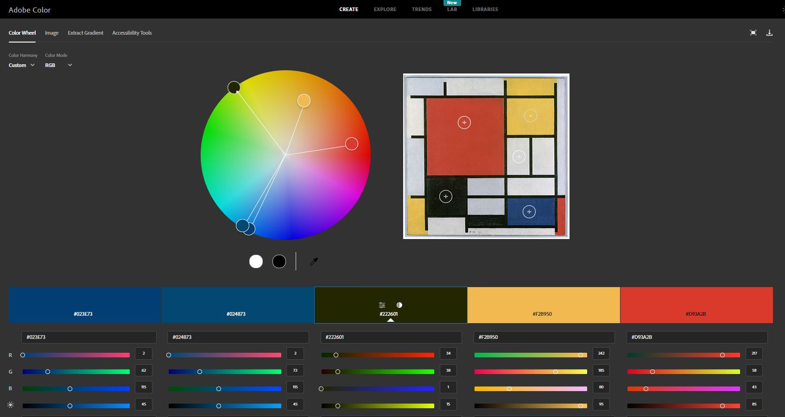
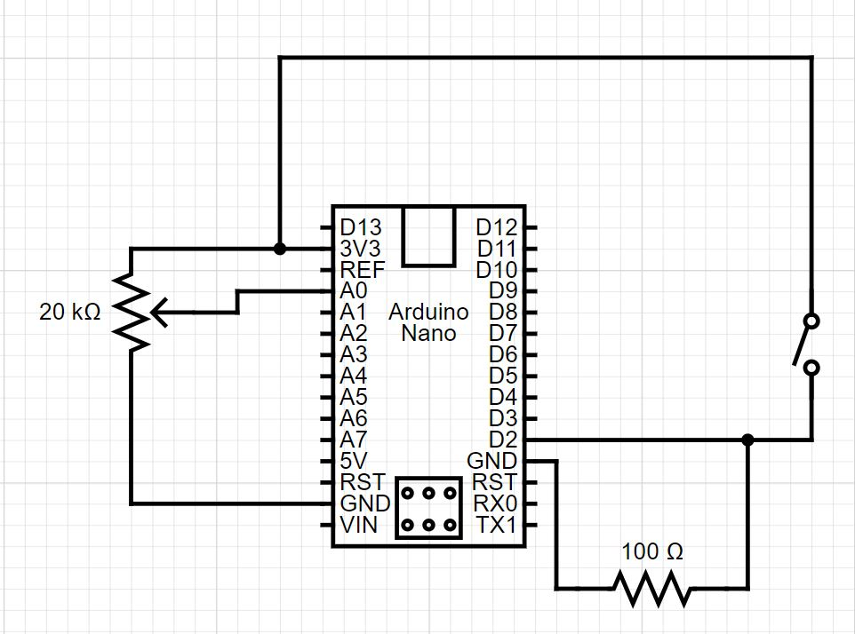
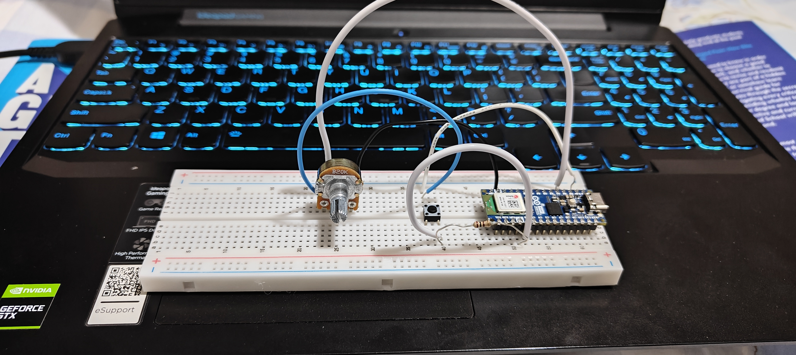

# Mondrian Art
▶️▶️**Technologies Used:** HTML, CSS, JavaScript, p5.js, Arduino Nano (C++)

This project revolves around manipulating colors & alpha channels (transparency) in <a href="https://en.wikipedia.org/wiki/Piet_Mondrian" target="_blank"> Piet Mondrian</a> paintings. I've set up a canvas to have two halves: the left consisting of the painting, and the right half consisting of handles to manipulate colors, transparency and image overlays.

### PART 1: Color Detection
I'm detecting colors using individual RGB ranges of all the hues involved. I had utilized *Adobe Color* to get the RGB values of the reds, blues & yellows present in the image. Using those, I've coded in a gamut that corresponds to each primary color.

<p align = "center">

<br>
Figure 1.1: Gathering RGB Values of Primary Hues - Adobe Color </p>

```
//detecting red color in duplicate image, and modifying pixel values
if((imgRedVal<=255 && imgRedVal>=175) && (imgGreenVal<=150 && imgGreenVal>=0) && (imgBlueVal<=255 && imgBlueVal>=0))

//detecting yellow color in duplicate image, and modifiying pixel values
if((imgRedVal<=255 && imgRedVal>=200) && (imgGreenVal<=255 && imgGreenVal>=100) && (imgBlueVal<=100 && imgBlueVal>=0))

//detecting blue color in duplicate image, and modifiying pixel values
if((imgRedVal<=100 && imgRedVal>=0) && (imgGreenVal<=100 && imgGreenVal>=0) && (imgBlueVal<=255 && imgBlueVal>=95))    
```

### PART 2: Color & Alpha-Channel Manipulation
This is where the physical computing aspect comes in. I'm making use of an Arduino Nano ESP32 board to enable interactivity. A *potentiometer* is used for controlling the image's transparency values. Additionally, I've stacked the original Mondrian art and the live-manipulated version on top of each other so that user modifications can be seen simultaneously.

<p align = "center">

<br>
Figure 2.1: Schematic Diagram of the Circuit
<br>
<br>

<br>
Figure 2.2: Actual Arduino Circuit </p>

A *physical button* enables/disables a "collage image" that places another image below the edited Mondrian painting. That way, any modifications to the original Mondrian results in a "window effect".

It's the Windows 11 dark-mode wallpaper, so quite literally, a *windows* effect. :P

I've created variables that store values that Arduino pushes. For the *potentiometer*, I've mapped the range of 0-4095 to 0-255, that corresponds to the alpha channel. Similarly, I've coded the functionality in such a way that Arduino sends **only** the button-click count i.e. the number of times the button is pressed. I've used a modulus operator (%) to have it cycle between just 2 discrete values: 0 & 1, which I then map to the radio buttons' values.

```
//mapping potentiometer value to transparancy slider
  a0_val = map(a0.value, 0, 4095, 0, 255);

  //mapping button press to panel-image radio button
  if(d2.count)
  {
    d2_val = map(d2.count % 2, 0, 1, 0, 1)
  }
```

For toggling between the radio button values:
```
//activating transparency slider only AFTER serial connection established
  if(readyToReceive)
  {
    alphaSlider.value(a0_val); //this enables real-time movement of the slider "seek" corresponding to the potentiometer value
    alphaSlider_Val = a0_val;

    //generating back-panel image based on button click
    if(d2_val==0)
    {
      designerRadio.selected('ShowOG');
      designerRadio_Val = designerRadio.value()
    }
    else if(d2_val==1)
    {
      designerRadio.selected('ShowIMG');
      designerRadio_Val = designerRadio.value();
    }
  }
```